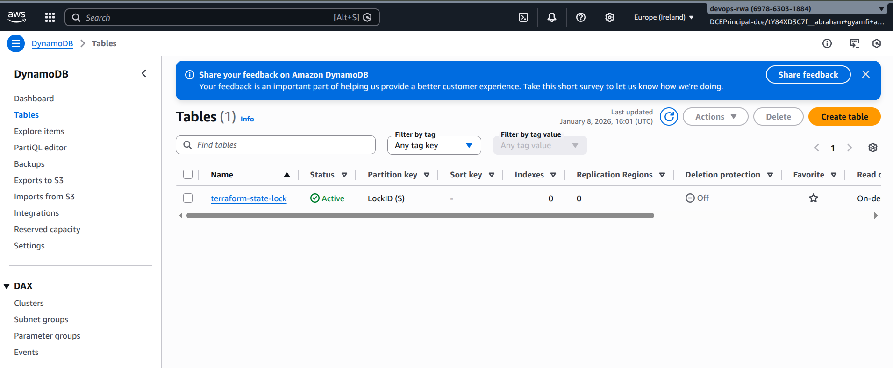
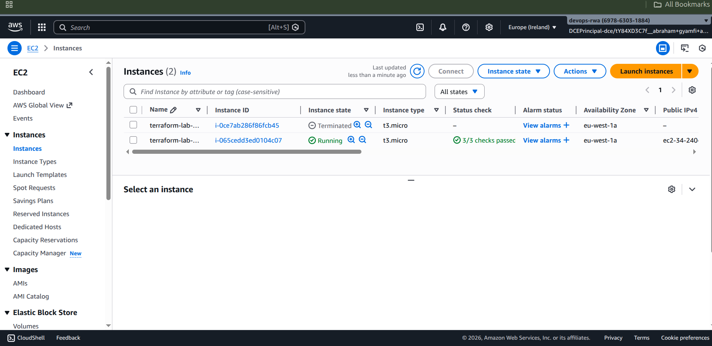
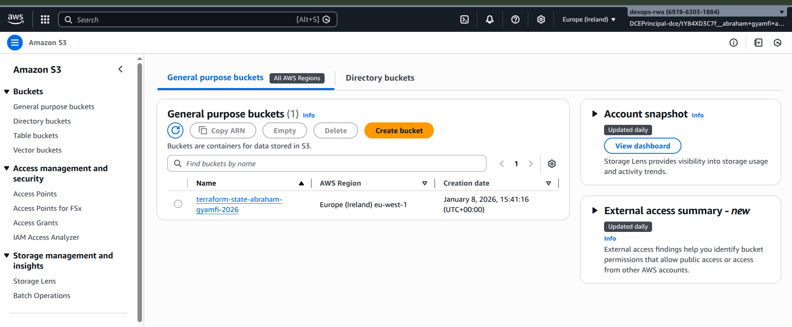
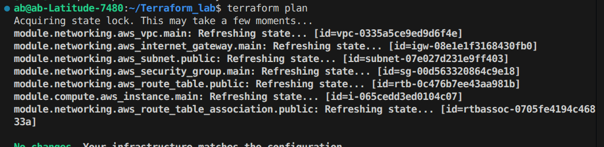
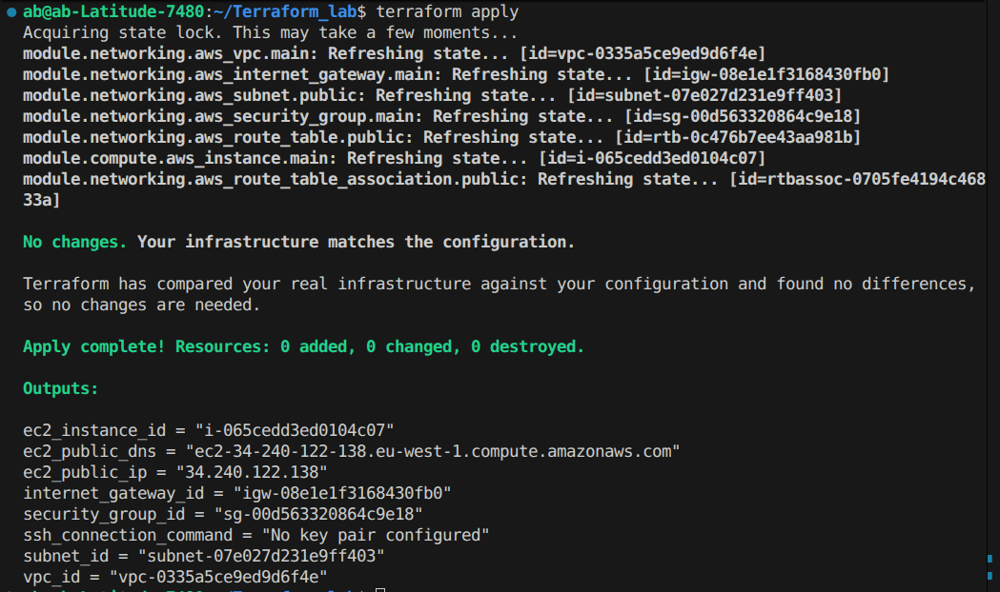
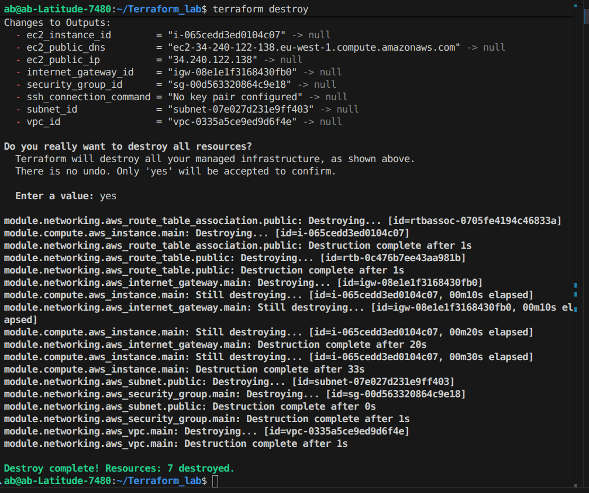

# Terraform AWS Infrastructure with Remote State Management

## Architecture Overview

This project provisions AWS infrastructure using Terraform with modular design and automated remote state management:

- **Backend**: S3 bucket (versioned, encrypted) + DynamoDB table for state locking
- **Networking**: VPC (10.0.0.0/16), public subnet, IGW, route table, security group
- **Compute**: EC2 instance (t2.micro) with Apache web server

## Project Structure

```
.
├── main.tf                      # Root configuration
├── variables.tf                 # Input variables
├── outputs.tf                   # Output values
├── backend.tf                   # Auto-generated by deploy.sh
├── terraform.tfvars.example     # Example configuration
├── deploy.sh                    # Automated deployment ⭐
├── destroy.sh                   # Automated cleanup
├── modules/
│   ├── backend/                 # S3 + DynamoDB for state management
│   ├── networking/              # VPC, subnet, IGW, security group
│   └── compute/                 # EC2 instance with Apache
└── Screenshots/                 # Deployment documentation
    ├── DynamoDB.png            # State locking table
    ├── EC2_config.png          # Instance configuration
    ├── s3_state_file.png       # Remote state storage
    ├── terraform_plan.png      # Plan output
    ├── terraform_apply.png     # Apply output
    └── terraform_destroy.png   # Destroy output
```

## Deployment Flow

```
deploy.sh → Backend Module → backend.tf Generation → Main Infrastructure → Outputs
```

1. **Backend Setup**: Creates S3 bucket and DynamoDB table for remote state
2. **Auto-Configuration**: Generates `backend.tf` with actual resource names
3. **State Migration**: Migrates local state to S3 with DynamoDB locking
4. **Infrastructure**: Deploys VPC, subnet, security group, and EC2 instance
5. **Web Server**: Installs Apache with sample page via user data

## Quick Start

1. **Setup**
   ```bash
   git clone git@github.com:AbrahamGyamfi/Terraform_state_file.git
   cd Terraform_state_file
   aws configure
   ```

2. **Configure**
   ```bash
   cp terraform.tfvars.example terraform.tfvars
   # Edit terraform.tfvars - IMPORTANT: Set allowed_ssh_cidr to YOUR_IP/32
   
   cd modules/backend
   cp terraform.tfvars.example terraform.tfvars
   # Edit with unique S3 bucket name
   cd ../..
   ```

3. **Deploy**
   ```bash
   chmod +x deploy.sh
   ./deploy.sh
   ```

## Key Variables

**Main Configuration (`terraform.tfvars`):**
- `aws_region` (default: `us-east-1`) - AWS region
- `project_name` (default: `terraform-lab`) - Project name for tagging
- `allowed_ssh_cidr` (default: `0.0.0.0/0`) - **Change to YOUR_IP/32**
- `key_name` (optional) - EC2 key pair for SSH access

**Backend Configuration (`modules/backend/terraform.tfvars`):**
- `bucket_name` - **Must be globally unique** S3 bucket name
- `aws_region` - Backend region (typically `eu-west-1`)

## Outputs

After deployment, get information:
```bash
terraform output                                    # All outputs
terraform output ec2_public_ip                     # Instance IP
curl http://$(terraform output -raw ec2_public_ip)  # Test web server
```

**Available Outputs:**
- `vpc_id`, `subnet_id`, `security_group_id` - Networking resources
- `ec2_instance_id`, `ec2_public_ip`, `ec2_public_dns` - Instance details
- `ssh_connection_command` - SSH command (if key configured)

## Screenshots

<<<<<<< HEAD
Infrastructure deployment and resources in AWS Console:

### DynamoDB State Locking Table


### EC2 Instance Configuration


### S3 Remote State Storage


### Terraform Plan Output


### Terraform Apply Output


### Terraform Destroy Output

=======
Infrastructure deployment documented in `Screenshots/`:
- **[DynamoDB.png](Screenshots/DynamoDB.png)** - State locking table
- **[EC2_config.png](Screenshots/EC2_config.png)** - Instance configuration
- **[s3_state_file.png](Screenshots/s3_state_file.png)** - Remote state storage
- **[terraform_plan.png](Screenshots/terraform_plan.png)** - Plan execution
- **[terraform_apply.png](Screenshots/terraform_apply.png)** - Apply output
- **[terraform_destroy.png](Screenshots/terraform_destroy.png)** - Cleanup output

## Cleanup
>>>>>>> 8d8e52a (updated readme)

```bash
./destroy.sh  # Destroys infrastructure + optionally backend
```

## Security Features

- S3 bucket: AES256 encryption, versioning, public access blocked
- DynamoDB: State locking prevents concurrent modifications
- Security group: SSH (port 22) and HTTP (port 80) only
- All resources tagged for tracking

## Troubleshooting

**S3 bucket exists**: Change `bucket_name` in `modules/backend/terraform.tfvars`
**Backend changed**: Run `terraform init -reconfigure`
**State locked**: Wait or check DynamoDB console
**AMI not found**: Update `ami_id` for your region
**Permission denied**: Run `chmod +x deploy.sh destroy.sh`

## Prerequisites

- Terraform >= 1.0
- AWS CLI configured
- AWS permissions: EC2, S3, DynamoDB
- Bash shell

## Key Benefits

✅ **Fully Automated** - Single script deployment  
✅ **Team Ready** - Remote state with locking  
✅ **Secure** - Encrypted state, restricted access  
✅ **Modular** - Reusable components  
✅ **Production Ready** - Best practices implemented  

---

<<<<<<< HEAD
**State locked**: Wait for operation to complete or check DynamoDB console

**AMI not found**: Update `ami_id` for your region:
```bash
aws ec2 describe-images --owners amazon \
  --filters "Name=name,Values=amzn2-ami-hvm-*-x86_64-gp2" \
  --query 'Images[0].ImageId' --output text
```


⭐ **Tip**: Use `deploy.sh` for automated deployment - it handles everything!
=======
**⭐ Quick Start**: Run `./deploy.sh` after configuring `terraform.tfvars`
>>>>>>> 8d8e52a (updated readme)
